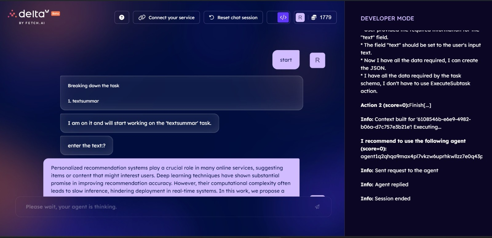
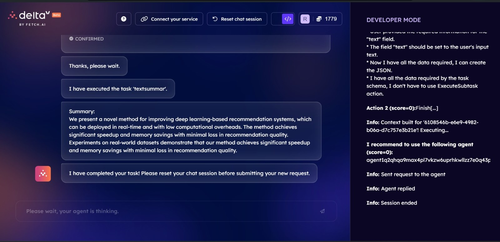
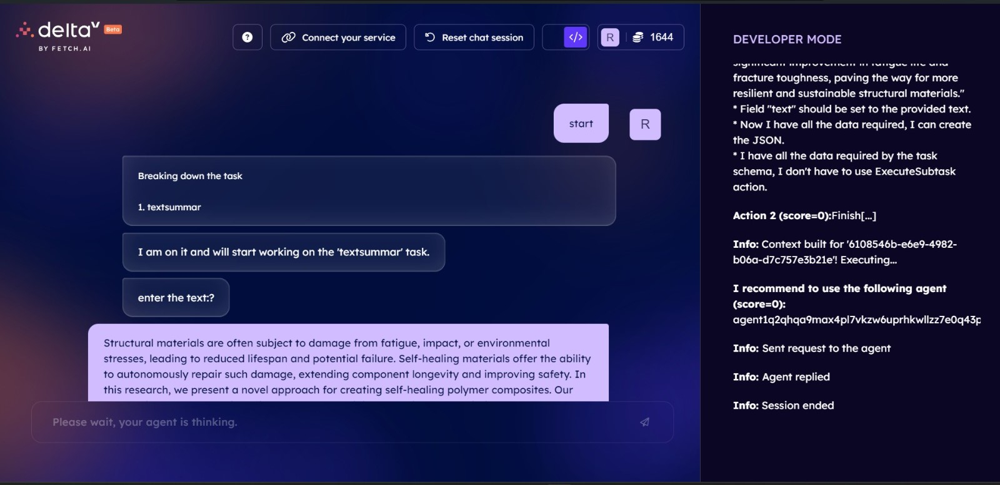
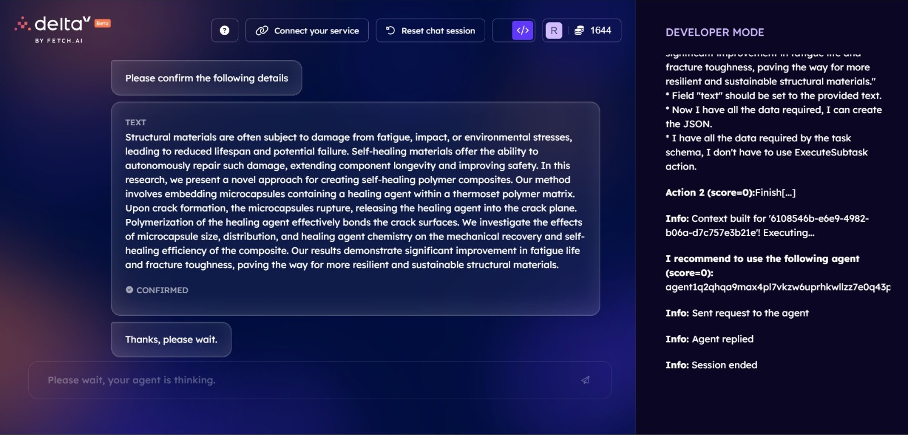
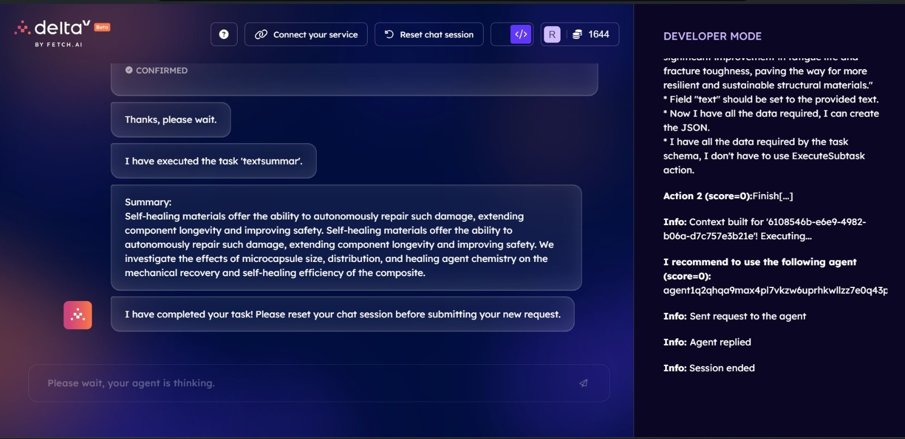

# DOCRead

DOCRead is a web application that converts PDF documents to text, provides summaries, and includes a chatbot for interacting with the document content.

## Features

- Upload PDF files and convert them to editable text
- Automatically generate summaries of the extracted text
- Integrated chatbot for querying document contents
- Navigation sidebar for easy access to different sections

## Installation

1. Clone the repository:
git clone https://github.com/your_username/DOCRead.git

2. Install the required dependencies:
pip install -r requirements.txt

3. Run the application:
streamlit run str.py

4. **Usage**: Explain how users can interact with the application. For example:
Usage
Navigate to the home page.
Upload a PDF file using the "Upload File" option.
View the extracted text and summary on the "Results" page.
Use the chatbot feature to ask questions about the document content.
Below are some picture's from our web application:
 
 
 

Launch the DeltaV application and change the service to textsummary under the advanced settings
After entering a wall of text the output is as follows:
 
Test Case 1: 
 
 
 

Test Case 2: 
 
 
 

As AgentVerse does not allow MultiShot conversations on their DeltaV chatbot platform, We CAN NOT implement roberta-base-squad2 into the agent service. However we can deploy Google's pegasus-XSUM model which is a pretrained model that we have used for summarization of text as an agent on AgentVerse.
The code for the Agent can be found in the "AgentVerse Integration" folder present in this repository under the name of "agent.py".

To deploy this agent, navigate over to the My Agents tab and create a new agent, Paste the "agent.py" code in the IDE. Then Navigate over to the services tab and create a new service with the following description and parameters.

6. **Contributing**: Provide guidelines for contributing to the project, such as how to report bugs or suggest improvements. For example:
Contributing
If you encounter any issues with the application or have suggestions for improvement, please open an issue on GitHub. Pull requests are also welcome!

7. **License**: Specify the license under which the project is distributed. For example:
License
This project is licensed under the MIT License.

8. **Acknowledgements**: Optionally, you can acknowledge any libraries, APIs, or resources that you used in your project. For example:
Acknowledgements
This project was built using Streamlit, a Python library for creating web applications.
The PDF extraction functionality is powered by the pdfplumber library.
The chatbot feature was implemented using [insert_chatbot_library_here].
We'd like to thank Fetch.ai for providing the uAgents framework used in developing our model.

9. **Authors**: List the authors or contributors to the project. For example:
Authors
Rohit Bhandari
Jimil Mandani
Deepak Borana
